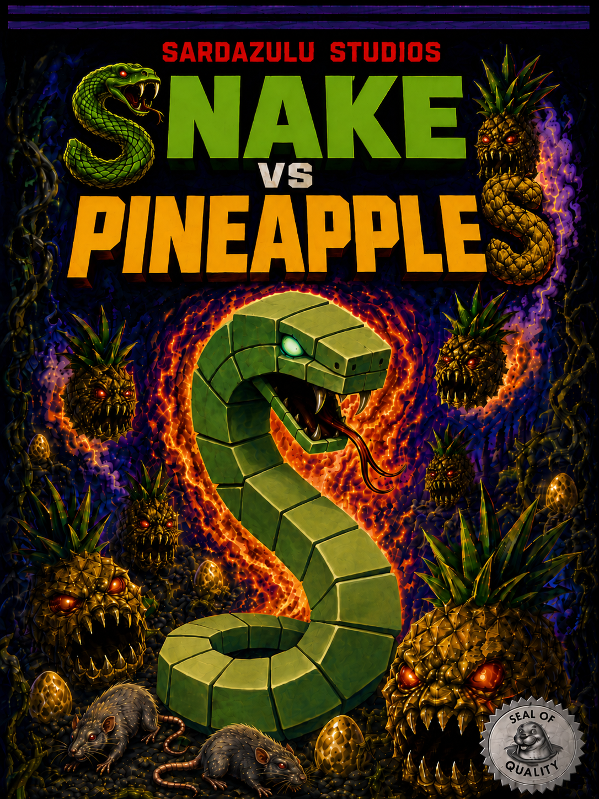
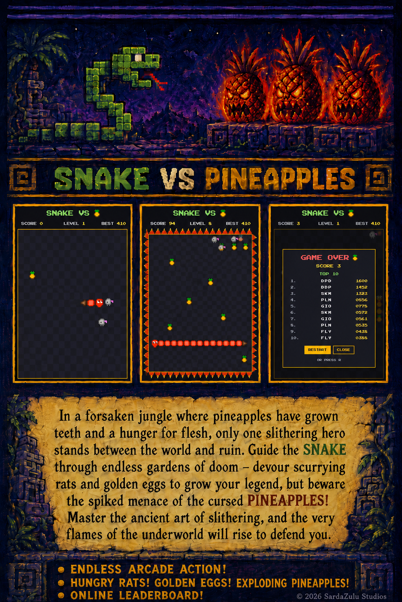

# snake-bit

Snake, with a few (pineapple) twists.

  
  

Play: https://gidili.github.io/snake-bit/

## Twists

- **Three foods, not one.** Rats (1pt) are the bread and butter. Eggs (3pt) are the bonus. Pineapples are instant death: do not touch.
- **Levels ramp the tick rate.** Every level makes the snake faster. You also get a score bonus proportional to the new level when you ramp up.

## Controls

Arrow keys, numeric keypad, or WASD. Space to pause. On mobile, you can swipe.
