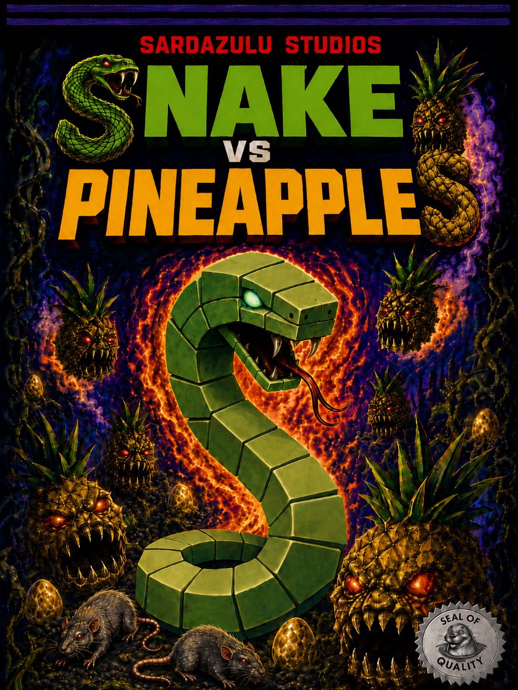
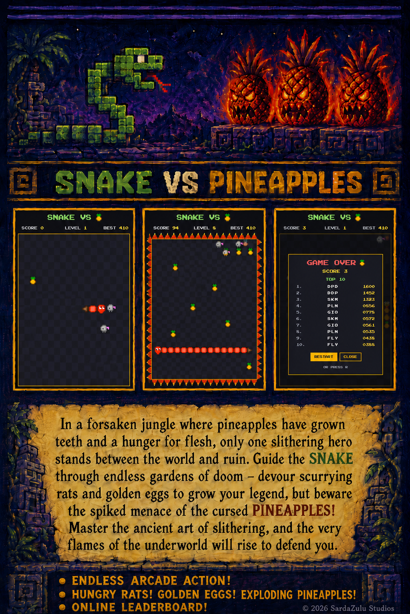

# snake-bit

Snake, with a few (pineapple) twists.

  
  

Play: https://gidili.github.io/snake-bit/

## Twists

- **Three foods, not one.** Rats (1pt) are the bread and butter. Eggs (3pt) are the bonus. Pineapples are instant death: do not touch.
- **Levels ramp the tick rate.** Every level makes the snake faster. You also get a score bonus proportional to the new level when you ramp up.

## Controls

Arrow keys, numeric keypad, or WASD. Space to pause. On mobile, you can swipe.

## Scores

The leaderboard is Postgres (Supabase). A score is only accepted for a game the
server itself timed, so `time_played` can't simply be asserted by the client:

- `start_game()` opens a session and stamps `started_at`
- `end_game(id)` stamps `ended_at` when the snake dies
- `submit_score(id, payload)` validates the payload against `ended_at - started_at`,
  then marks the session used — one session buys exactly one row

`game_sessions` has RLS on with no policies, so the anon key can't reach it
directly; everything goes through those three `security definer` functions.

Everything needed to rebuild this lives in `supabase/`:

| File | What it is |
|---|---|
| `session-validation.sql` | The schema: table, the three functions, RLS, grants. Run once. |
| `prune-sessions.sql` | A daily `pg_cron` job, `prune-orphan-game-sessions`, firing at 03:17 UTC. Every page load opens a session, and most are never played to a finish, so it deletes sessions older than 7 days that were never used. Sessions that *did* produce a score are kept — they're the audit trail for when the server saw that game start and end. |
| `rollback/` | The pre-session-validation function definition, as captured from production. |

None of this deploys with the site — the tag-triggered workflow only ships the
client. Database changes are applied by hand in the SQL editor.
